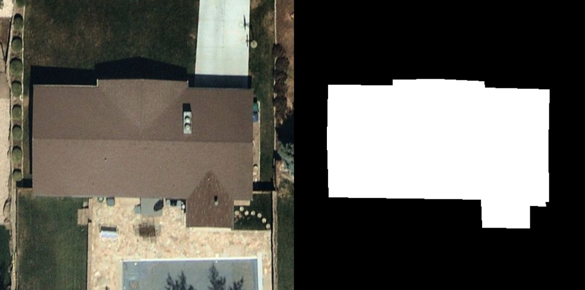

# Arturo ML Challenge
## Smit Jain

<br>

## Overview



Arturo is well-known in the insurance industry for extracting physical property characteristics from satellite and aerial imagery. The simplest characteristic of a building in overhead imagery is its footprint. In the figure above, the aerial image on the left shows an example of a residential building and on the right is its footprint as a binary mask. 

## Objective

Your task is to train a deep learning model that will accept as input an RGB image and return a binary mask containing all building footprints.

## Model

You will be training a modified U-Net. To simplify the training process, you will use a pre-trained [MobileNetV2](https://www.tensorflow.org/api_docs/python/tf/keras/applications/MobileNetV2) model as your encoder. You are to freeze these weights. Your job is to implement a U-net and train the decoder.

[Here](https://arxiv.org/pdf/1505.04597.pdf) is a link to the paper describing the U-Net architecture.

## Data
You’ve been provided examples of the following pairs of data for training: 

1. aerial RGB images
2. masks of building footprints 

This is real-world data similar to what we use to train our deep learning models at Arturo. The RGB images were captured in different locations, in different lighting conditions, at different altitudes, etc. The footprints were extracted via human annotation.

A test set has been withheld (in the same format). Be prepared to provide sample predictions and the following aggregate metrics: accuracy, precision, recall, mean IoU.

You’ll also want to be able to visualize the RGB image, ground truth mask, and model inference side-by-side for comparison.

## Evaluation
A minimal Flask app has been provided to you (`src/app.py`). In the app you must add a call to your model in the `inference` handler:
```python
@app.route('/inference', methods=["POST"])
def inference():
    data = request.json
    img_arr = np.array(data["image"], dtype=np.uint8)
    
    ...

    return {"prediction": random_mask.tolist()}
```
_Note_: A random mask is returned by default.

A minimal example of a _client_ has been provided as well, in notebook form (`src/client.ipynb`). This contains code that calls the Flask app and aggregates predictions. Similar code will be used to assess your model.

## Installation

A `requirements.txt` has been provided for you with some packages included. Use Python 3.7.8 to complete this project and update `requirements.txt` file as needed.

## Rubric

The team will assess your challenge based on the following criteria:

### Test Set
We will call your app and run metrics on a hold-out set. Here are some guidelines:
<br>

Minimmum:
- Precision - 0.8
- Recall - 0.8 
- IOU - 0.6 

Recommended:
- Precision - 0.95
- Recall - 0.95
- IOU - 0.85

_Note_: Feel free to experiment to achieve the best results you can, but keep in mind that we prefer creativity and well-reasoned decisions over raw model performance!

### Experimentation Results
- Provide documentation of your experimentation/iteration process to achieve your final reported metrics.

### Code Readability
- Submitted code will be read by our ML team. Ensure your source code is readable and easy to follow.

### Presentation 
- Be able to explain the core ideas of the U-net architecture.
- Be able to explain your choices for training (data processing, optimizer, loss, etc).


